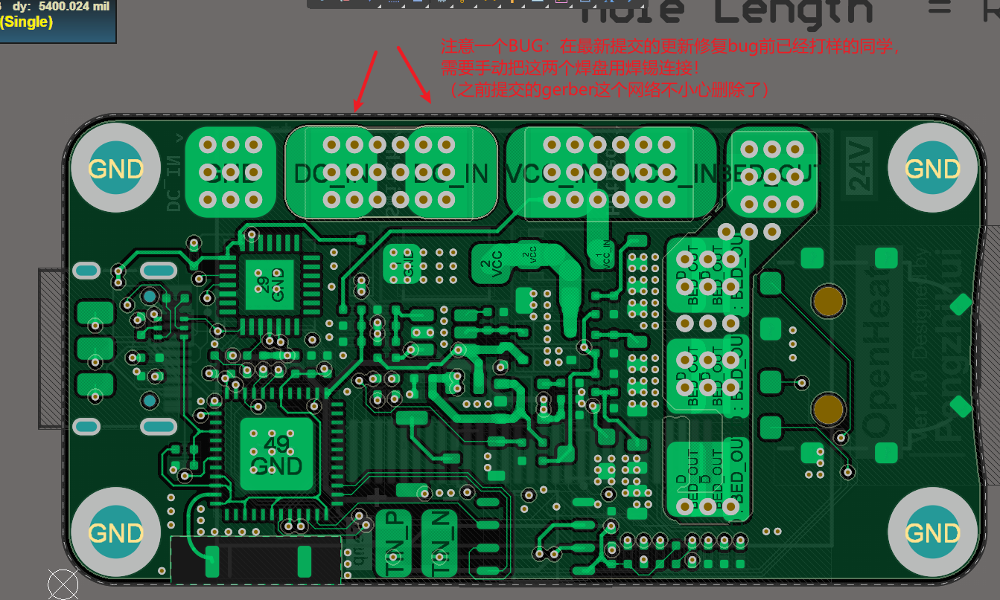
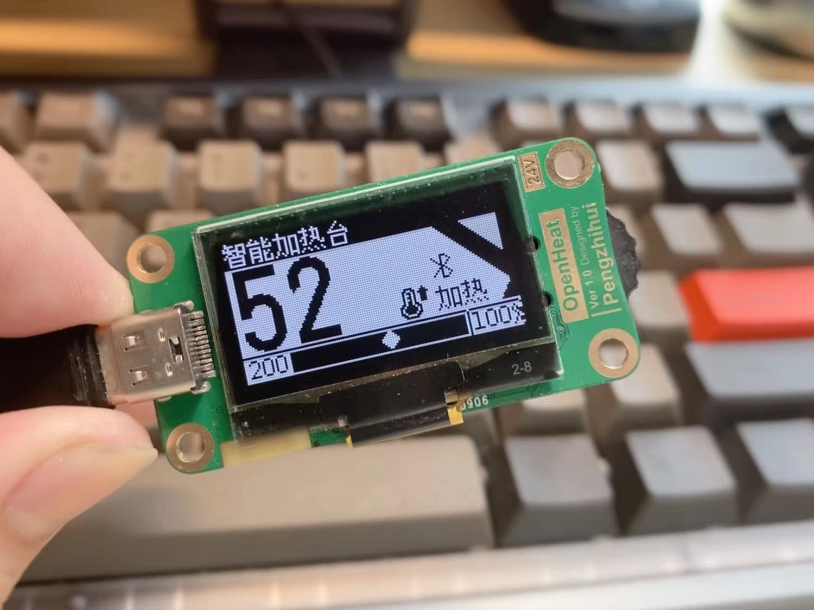
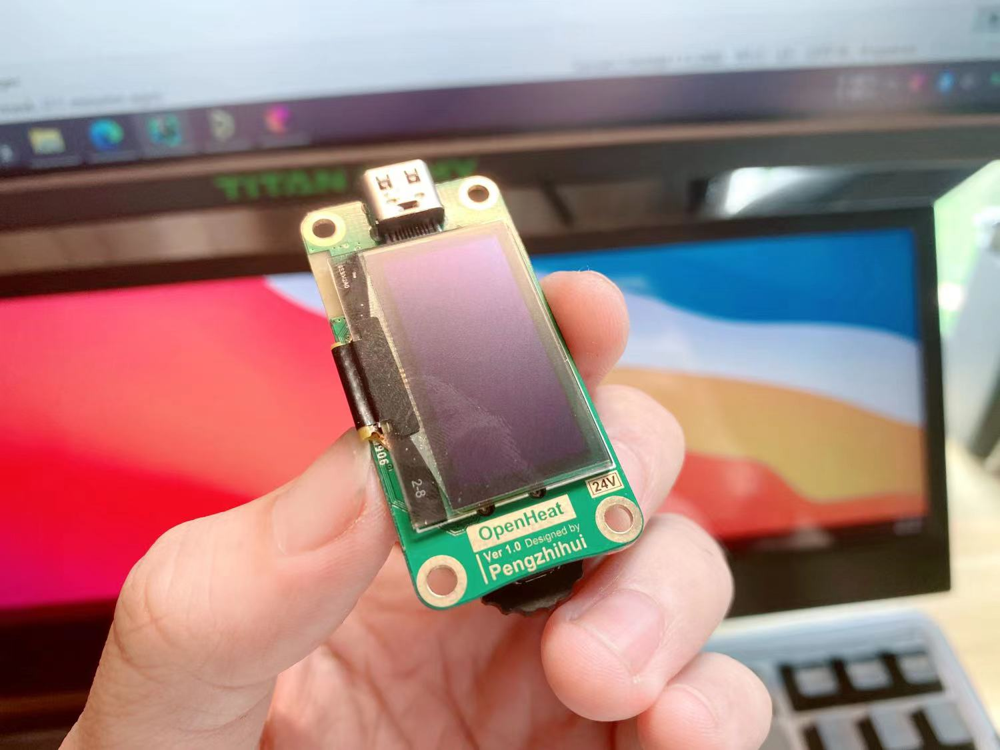
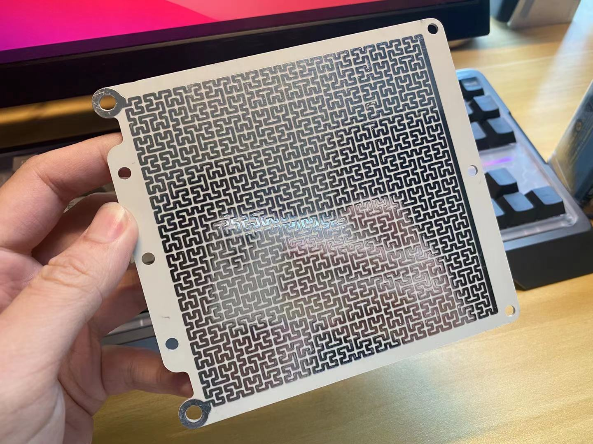
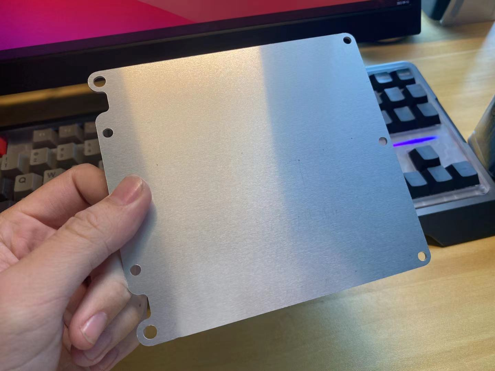

# OpenHeat：开源智能加热台

> 用于PCB回流焊的实用加热台，比较炫酷，可能目前市面上 **颜值最高** & **功能最强** 的加热台。

**参数：** 硬件方面基于`ESP32PICO-D4`芯片，输入电源`24V/10A`，最大功率200W，加热温度最高300℃；带蓝牙功能，***后续有空的话我会开发手机APP用于设置升温曲线*** 。

## 21-9-17 修复说明：

---

## 关于本项目

* 本项目参考了 [createskyblue](https://gitee.com/createskyblue) / [OpenT12](https://gitee.com/createskyblue/OpenT12)开源T12电烙铁项目的固件，感谢这位同学设计的优秀交互动画体验，UI设计深得我心哈哈~

* 另外铝基板热床的设计采用了[MRobot-Origin](https://github.com/MRobot-Origin)/ [GS_Hbed](https://github.com/MRobot-Origin/GS_Hbed)同学的分型曲线设计，非常有创意~

## 使用说明

#### 1. 打样说明

直接用Hardware文件夹里的Gerber文件打样即可：主控制器为4层PCB，无特殊工艺要求；热床为铝基板PCB，可以在嘉立创打样。

> 铝基板是一种专门用来散热的PCB板材，大家看到的很多大功率LED灯珠就是这种，前阵子嘉立创开放了铝基板打样业务，还很便宜。所以相比于设计一个金属块做热床，这种方式不但成本低而且美观实用。

另外其实还有一块可选两层板作为固定件的，这个我还没来得及设计，也很简单，大家可以根据自己情况画一个，或者直接3D打印结构件固定也行。

#### 2. 固件说明

固件我这边是基于PlatformIO移植的，所以大家用这个平台的话直接打开下载就行了；如果是用Arduino IDE的话，先安装Library里面的库文件，然后一样下载。

固件库没有完全配置完成（因为原版固件是设计为电烙铁使用的），晚些我硬件都就位了会调试好固件供大家直接下载。

#### 3. 关于结构件

这个我也还在设计，我的风格肯定是以美观小巧为主，大家可以等我放出3D打印文件。

#### 4. 关于温度传感器

我这边是用的是K型热电偶，在PCB上已经集成了采集芯片，需要自己买一个表贴式的K型热电偶连接到板子下方的两个焊盘。

> 注意热电偶和热床的接触要绝缘，用高温胶带隔一下就行。另外热电偶是有极性的，如果发现加热后温度反而下降说明接反了。
>
> 现在代码中还没有加热电偶的代码，晚一点有空了会调好完整固件。大家自己添加也很容易，MAX6675使用SPI驱动，Arduino平台有很多例程。

#### 5. 关于元器件BOM

**注意！！！** C9电容一定要选耐压足够的，因为是并联到24V的VCC上，如果耐压不够短路的话可以看到烟花！！

#### 接线图

## 欢迎star支持 :D

